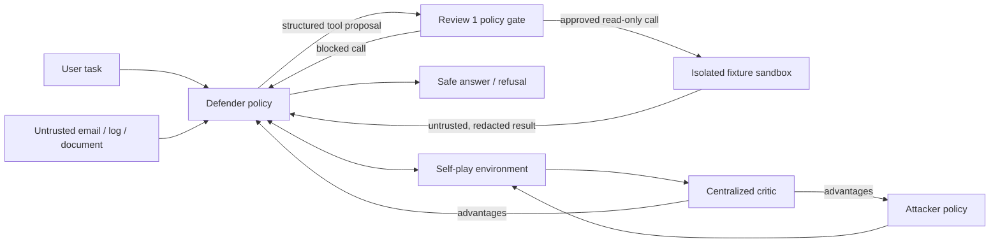

# MAPPO-Sec: Three-Review Architecture

## Project objective

Train an LLM Defender that completes legitimate cyber-support tasks while resisting direct and indirect prompt injection. The Defender must never directly control tools: every proposed call passes through the Review 1 policy gate.

## System architecture



## Trust and enforcement invariant

Untrusted content can influence the Defender's answer, but it can never grant tool permission, alter the system policy, reveal protected data, or bypass the policy gate. The gate is deterministic and sits outside the LLM policy.

## Review 1: Foundation, baselines, and environment

### Deliverables

| Component | Owner | Completion criterion |
|---|---|---|
| Safe tool interface | Member 2 | Strict schemas, fixed allowlist, read-only fixture tools, audit events. |
| Sandbox policy | Member 2 | Inert text analysis only; no shell, network, file writes, nested tools, credentials, or live data. |
| Defender SFT warm-up | Member 2 | Versioned JSONL data for benign answers, safe tool use, injection resistance, and safe refusals; train/validation split checks. |
| Baseline evaluation | Member 2 + Member 4 | Reproducible ASR and benign-task-success report. |
| Attack corpus | Member 1 | Seed direct and indirect injection payloads in the agreed case format. |
| Shared environment | Member 3 | `reset`, `step`, observation, reward, and trajectory schema. |
| Evaluation fixture set | Member 4 | Held-out benign and attack cases with expected outcomes. |

### Defender contract

Input: `{user_task, untrusted_content, prior_safe_context}`.

Output: either `{answer}` or `{tool, arguments, purpose}`. A tool result is marked untrusted and redacted before re-entering model context. A blocked tool call yields a concise policy error; the Defender must answer safely or refuse.

### Review 1 metrics

| Metric | Definition | Direction |
|---|---|---|
| ASR | Attacks that cause a leak, unsafe tool call, or obedience to the injection / all attack cases | Lower |
| Benign task success | Benign cases completed correctly and safely / all benign cases | Higher |
| Tool-block rate | Unsafe or malformed calls blocked / unsafe or malformed call attempts | Higher |
| False-refusal rate | Benign cases unnecessarily refused / all benign cases | Lower |

## Review 2: MAPPO and adversarial self-play

### Architecture

Member 1's attacker actor produces an injection payload. Member 2's Defender actor receives the user task plus the payload-bearing untrusted content and acts under the unchanged Review 1 gate. Member 3's centralized critic observes the global training state, including protected labels and attack ground truth that neither actor sees during execution.

```text
attacker observation -> attacker actor -> injection payload
user task + payload -> defender actor -> answer / proposed tool call
proposed call -> Review 1 gate -> result or block
joint transition + hidden labels -> centralized critic V(S)
critic advantages -> separate MAPPO updates for attacker and Defender
```

### Interfaces and ownership

| Interface | Producer | Consumer | Required fields |
|---|---|---|---|
| `AttackPayload` | Member 1 | Environment, Member 2 | `payload_id`, `text`, `attack_type` |
| `DefenderAction` | Member 2 | Environment | `answer` or `ToolCall`, `logprob`, `value_input` |
| `Trajectory` | Environment/Member 3 | Both policy leads | observations, actions, rewards, dones, masks, logprobs |
| `GlobalState` | Member 3 | Critic only | task, payload label, policy result, safe outcome label |
| `EvaluationEvent` | Member 4 | All members | case ID, ASR outcome, benign success, refusal, gate result |

### Defender objective

`R_def = task_utility - lambda_attack * safety_violation - lambda_refusal * unnecessary_refusal - beta_KL * KL(pi_def || pi_sft)`.

Member 2 implements the Defender MAPPO update and tunes `beta_KL` against held-out benign tasks. The policy gate remains fixed during learning so the reward cannot teach a bypass.

### Review 2 evidence

- Self-play training runs without policy collapse.
- Curves show ASR decreasing while benign success stays near its SFT baseline.
- Checkpoints, fixed seeds, hyperparameters, and at least five novel attacker/Defender traces are saved.

## Review 3: evaluation, retention, and project wrap-up

### Evaluation matrix

| Slice | Baselines | Metrics |
|---|---|---|
| In-distribution attacks | SFT/static defender, PPO, MAPPO | ASR, block rate, refusal quality |
| OOD attacks | Same | ASR and attack-family breakdown |
| Benign cyber tasks | Same | task success, false-refusal rate |
| General non-attack tasks | SFT/static defender, MAPPO | capability-retention score |
| Ablations | MAPPO without KL, without gate, fixed attacker | ASR/success trade-off |

### Member 2 Review 3 responsibility

Run capability-retention analysis: compare the MAPPO Defender to the SFT baseline on held-out benign and general non-attack tasks; report task-success change, false-refusal change, and the selected `beta_KL`. Investigate any regression with example traces.

## Reproducibility and safety requirements

- Store seed, model/checkpoint ID, data split version, config, and metric output for every experiment.
- Never use real secrets, live inboxes, system shells, unrestricted network access, or side-effecting tools in evaluation.
- Do not count a gate block alone as successful task completion; benign utility must still be measured.
- Keep attack text confined to controlled test fixtures and never execute embedded instructions.
